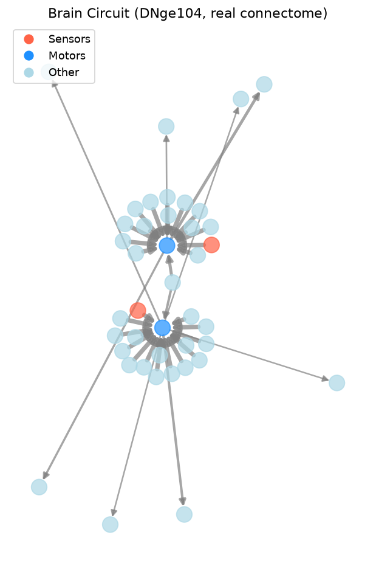
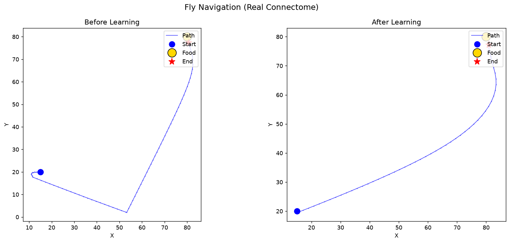
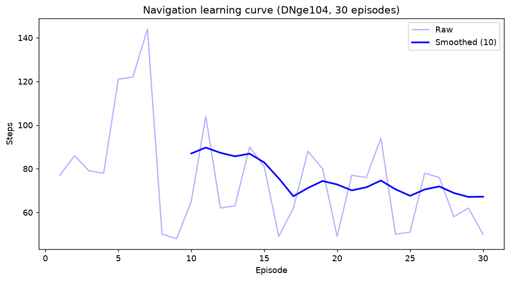

# flynet

Spiking neural network library based on the *Drosophila melanogaster* brain connectome.

Build, simulate, and train spiking neural networks using real fruit-fly connectome wiring
from [neuPrint](https://neuprint.janelia.org) / [FlyWire](https://flywire.ai), or define
your own brain structures programmatically.

```python
from flynet import SpikingNetwork, ConnectomeLoader

# Load the real fly brain
loader = ConnectomeLoader()
ids, edges, motors = loader.load_or_fetch_mini(neuron_type="DNge104")
net = SpikingNetwork(ids, edges, motor_ids=motors)

# Settle under sensory input and read motor output
trace = net.settle(z_right=2.0, z_left=0.5)
drv, _ = net.turn(rho_right=2.0, rho_left=0.5)
```

## Setup

### 1. Create virtual environment and install

```bash
make venv            # create .venv/
make install-dev     # install with pytest
```

Or manually:

```bash
python3 -m venv .venv
.venv/bin/pip install -e ".[dev]"
```

Requires Python >= 3.10.

### 2. Set up the neuPrint token (optional, for real connectome data)

Get a free API token from https://neuprint.janelia.org (Account -> Token), then:

```bash
# Option A: .env file (persistent, recommended)
echo "NEUPRINT_APPLICATION_CREDENTIALS=your-token-here" > .env

# Option B: shell export (temporary)
export NEUPRINT_APPLICATION_CREDENTIALS="your-token-here"
```

The `.env` file is loaded automatically by `make` and kept out of git via `.gitignore`.
Without a token, all offline/synthetic features work exactly the same.

### 3. Verify

```bash
make test-all        # unit tests + syntax check
```

## Makefile Targets

Run `make help` to see all targets:

```
  install                Install in editable mode (core deps only)
  install-dev            Install with dev extras (pytest, etc.)
  install-all            Install with all extras (neuprint, dev, etc.)
  venv                   Create the virtual environment
  test                   Run unit tests
  test-quiet             Run unit tests (quiet)
  test-cov               Run tests with coverage report
  lint                   Syntax-check all source files
  typecheck              Run mypy on source (optional, not strict)
  build                  Build wheel and sdist
  clean                  Remove build artifacts
  examples               Run all examples
  example-basic          Run basic network example
  example-connectome     Run connectome simulation (offline)
  example-navigation     Run navigation task (offline, 5 episodes)
  cli-list               List available connectome datasets
  cli-simulate-offline   Simulate with synthetic brain (no token needed)
  cli-simulate           Simulate with real connectome (needs token)
  cli-train              Train with real connectome (needs token)
  cli-train-offline      Train with synthetic brain (no token needed)
  test-neuprint          Test real neuPrint mini brain fetch + simulate
  test-all               Run tests + syntax check
```

## Features

| Module | What it does |
|---|---|
| `neurons` | Leaky Integrate-and-Fire and simple threshold neurons with refractory periods |
| `synapses` | Sparse (scipy CSR) and dense weight matrices with edge-list construction |
| `encoding` | Rate-coded and Poisson spike train generation |
| `receptive_fields` | Gaussian and Manhattan-distance spatial filtering kernels |
| `stdp` | Spike-Timing-Dependent Plasticity with reward-modulated eligibility traces |
| `inhibition` | Winner-takes-all and soft lateral inhibition, dynamic thresholds |
| `network` | `SpikingNetwork` -- settling dynamics, calibration, sensor-to-motor steering |
| `connectome` | `ConnectomeLoader` -- neuPrint fetch, disk caching, offline/synthetic fallback |
| `learning` | `RewardHebbian` (three-factor) and `STDPTrainer` training pipelines |
| `visualize` | Brain circuits, trajectories, learning curves, spike rasters, weight heatmaps |
| `cli` | `flynet simulate`, `flynet train`, `flynet list-datasets` |

## Quick Start

### Load a real connectome

```python
from flynet.connectome import ConnectomeLoader
from flynet.network import SpikingNetwork

loader = ConnectomeLoader(dataset="male-cns:v1.0")

# Small brain slice (~41 neurons around a cell type)
ids, edges, motors = loader.load_or_fetch_mini(neuron_type="DNge104")
net = SpikingNetwork(ids, edges, motor_ids=motors)

# Or the whole fly brain (~176k neurons, stored sparse)
ids, edges, motors = loader.load_or_fetch_full(min_weight=50)
net = SpikingNetwork(ids, edges, motor_ids=motors if motors else None)
```

All connectome data is cached to `~/.flynet/cache/` for offline use.

### Simulate the brain

```python
# Inject sensory input and settle to a fixed point
trace = net.settle(z_right=2.0, z_left=0.5, iterations=12)
# trace is a list of 12 activity vectors, one per iteration

# Calibrate the sensor-to-motor mapping
M, Minv = net.calibrate()

# Compute a steering command from smell readings
drv, trace = net.turn(rho_right=2.0, rho_left=1.0)
# drv > 0 means turn right, < 0 means turn left

# Query the wiring
net.presynaptic(12781)   # who talks to this neuron?
net.postsynaptic(12781)  # who does this neuron talk to?
net.get_weight(25185, 12781)  # synapse strength
```

### Train with reward-gated Hebbian plasticity

```python
from flynet.learning import RewardHebbian

hebbian = RewardHebbian(eta=0.6, reward_bonus=6.0)

# After a successful navigation episode, collect events and update:
events = [(rho_right, rho_left, activity), ...]
hebbian.update(net, events)
```

### Train with STDP

```python
from flynet import SpikingNeuron, SynapseList, STDPRule, LateralInhibition

synapses = SynapseList(n_post=10, n_inputs=784)
stdp = STDPRule()
inhibition = LateralInhibition(mode="wta")

# In your training loop:
neurons = [SpikingNeuron(threshold=5.0) for _ in range(10)]
# ... simulate and apply STDP updates on spike pairs
```

## Examples

The `examples/` directory contains complete scripts:

| Script | Description | Token? |
|---|---|---|
| `basic_network.py` | Create a small network, settle, calibrate, STDP demo | No |
| `connectome_simulation.py` | Load real connectome and query wiring | Optional |
| `navigation_task.py` | Fly navigates to food using real brain wiring + Hebbian learning | Optional |
| `classification.py` | Unsupervised STDP pattern learning | No |

```bash
make example-basic           # or: .venv/bin/python examples/basic_network.py
make example-connectome      # offline connectome demo
make example-navigation      # offline navigation with learning
```

## Architecture

```
flynet/
  __init__.py          Package exports
  neurons.py           LIFNeuron, SpikingNeuron, NeuronModel ABC
  synapses.py          SynapseMatrix (CSR sparse), SynapseList (dense)
  encoding.py          rate_encode, poisson_encode, SpikeTrain
  receptive_fields.py  ReceptiveField, manhattan_rf, apply_rf
  stdp.py              STDPRule, RewardModulatedSTDP
  inhibition.py        LateralInhibition, ThresholdManager
  network.py           SpikingNetwork (settle, calibrate, turn)
  connectome.py        ConnectomeLoader (neuPrint, caching, synthetic)
  learning.py          RewardHebbian, STDPTrainer, TrainingLogger
  visualize.py         plot_brain_circuit, plot_trajectory, etc.
  cli.py               flynet CLI entry point
```

**Total: ~3,100 lines** of Python across 12 modules, with 40 tests.

## Results

### Brain Circuit (DNge104 Mini Brain)



Real connectome wiring of the DNge104 descending neuron and its partners.
Red = sensors, Blue = motors, Grey = other neurons. Edges are proportional to synapse weight.

### Navigation: Before vs After Learning



The fly starts at (15, 20) and navigates toward food at (80, 80) by sensing a smell gradient.
Left: before learning (77 steps). Right: after 5 episodes of Hebbian training (50 steps).

### Learning Curve



Steps to reach food decrease as reward-gated Hebbian plasticity strengthens co-active synapses.

## Tested With

| Connectome | Neurons | Edges | Result |
|---|---|---|---|
| DNge104 mini brain | 41 | 40 | 100% navigation success, learning reduces path 77 -> 43 steps |
| Full male CNS | 66,729 | 228,220 | Settles in <0.1s, 1,236 neurons activate, steering works |

## License

MIT
