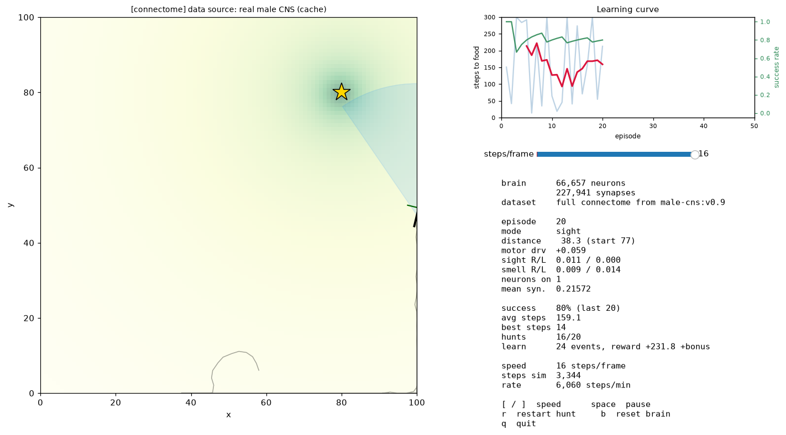
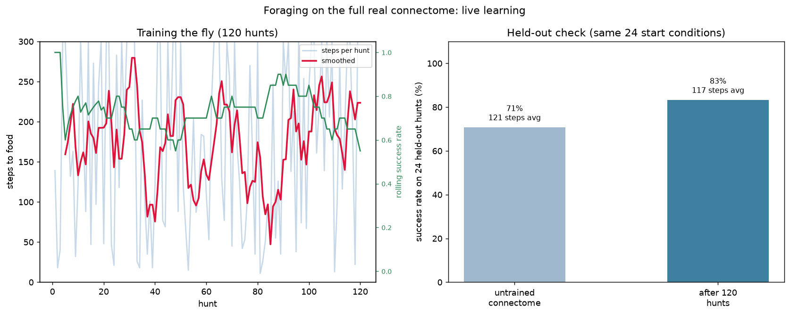

# flynet

[](https://github.com/Zikithezikit/flynet/actions/workflows/ci.yml)

Spiking neural network library based on the *Drosophila melanogaster* brain connectome.

Build, simulate, and train spiking neural networks using real fruit-fly connectome wiring
fetched from [neuPrint](https://neuprint.janelia.org) (hemibrain, male CNS, MANC, and other
FlyEM-derived datasets), or define your own brain structures programmatically.

```python
from flynet import SpikingNetwork, ConnectomeLoader

# Load the real fly brain
loader = ConnectomeLoader()
ids, edges, motors = loader.load_or_fetch_mini(neuron_type="DNge104")
net = SpikingNetwork(ids, edges, motor_ids=motors)

# Settle under sensory input and read motor output
trace = net.settle(z_right=2.0, z_left=0.5)
drv, _ = net.turn(rho_right=2.0, rho_left=0.5)
```

## Setup

### 1. Create virtual environment and install

```bash
make venv            # create .venv/
make install-dev     # install with pytest
```

Or manually:

```bash
python3 -m venv .venv
.venv/bin/pip install -e ".[dev]"
```

Requires Python >= 3.10. Continuous integration (`.github/workflows/ci.yml`)
runs lint, Google-style docstring checks, strict mypy type checking, and the
full test suite on Python 3.10, 3.11, and 3.12.

### 2. Set up the neuPrint token (optional, for real connectome data)

Get a free API token from <https://neuprint.janelia.org> (Account -> Token), then:

```bash
# Option A: .env file (persistent, recommended)
echo "NEUPRINT_APPLICATION_CREDENTIALS=your-token-here" > .env

# Option B: shell export (temporary)
export NEUPRINT_APPLICATION_CREDENTIALS="your-token-here"
```

The `.env` file is loaded automatically by `make` and kept out of git via `.gitignore`.
Without a token, cached data and the explicitly-synthetic features (`--offline`,
`ConnectomeLoader.synthetic_brain()`) work exactly the same; only the *first*
fetch of real connectome data needs a token (plus the `neuprint` extra). If a
real fetch fails, flynet raises `ConnectomeUnavailableError` and exits loudly —
it never silently substitutes synthetic data for the real brain.

### 3. Verify

```bash
make check           # all gates: lint + docstyle + typecheck + tests
make test-all        # unit tests + syntax check
```

## Makefile Targets

Run `make help` to see all targets:

```
  install                Install in editable mode (core deps only)
  install-dev            Install with dev extras (pytest, etc.)
  install-all            Install with all extras (neuprint, dev, etc.)
  venv                   Create the virtual environment
  test                   Run unit tests
  test-quiet             Run unit tests (quiet)
  test-cov               Run tests with coverage report
  lint                   Syntax-check all source files
  docstyle               Check Google-style docstrings (pydocstyle)
  typecheck              Run mypy on source (strict config in pyproject.toml)
  check                  Run all gates: lint, docstyle, typecheck, tests
  build                  Build wheel and sdist
  clean                  Remove build artifacts
  examples               Run all examples
  example-basic          Run basic network example
  example-connectome     Run connectome simulation (offline)
  example-navigation     Run navigation task (offline, 5 episodes)
  example-gui            Open the interactive foraging GUI (real brain)
  example-gui-smoke      Headless foraging GUI check (synthetic, no token)
  cli-list               List available connectome datasets
  cli-simulate-offline   Simulate with synthetic brain (no token needed)
  cli-simulate           Simulate with real connectome (needs token)
  cli-train              Train with real connectome (needs token)
  cli-train-offline      Train with synthetic brain (no token needed)
  test-neuprint          Test real neuPrint mini brain fetch + simulate
  test-all               Run tests + syntax check
```

## Features

| Module | What it does |
| --- | --- |
| `neurons` | Leaky Integrate-and-Fire and simple threshold neurons with refractory periods |
| `synapses` | Sparse (scipy CSR) and dense weight matrices with edge-list construction |
| `encoding` | Rate-coded and Poisson spike train generation |
| `receptive_fields` | Gaussian and Manhattan-distance spatial filtering kernels |
| `stdp` | Spike-Timing-Dependent Plasticity with reward-modulated eligibility traces |
| `inhibition` | Winner-takes-all and soft lateral inhibition, dynamic thresholds |
| `network` | `SpikingNetwork` -- rate-based settling dynamics, calibration, sensor-to-motor steering |
| `connectome` | `ConnectomeLoader` -- neuPrint fetch, disk caching, `ConnectomeUnavailableError` on fetch failure (never a silent synthetic fallback); synthetic only via `synthetic_brain()` / CLI `--offline` |
| `learning` | `RewardHebbian` and `MotorRewardHebbian` (three-factor, signed rewards) plus `STDPTrainer` pipelines |
| `jax_network` | `JaxNetwork` -- differentiable FLYNN-style (arXiv 2607.00025) recurrent dynamics on the connectome |
| `jax_trainer` | `GradientTrainer` (DAgger-style BPTT imitation), `RLTrainer` (REINFORCE), `ExpertTeacher` |
| `visualize` | Brain circuits, trajectories, learning curves, spike rasters, weight heatmaps |
| `cli` | `flynet simulate`, `flynet train --method hebbian | gradient | rl`,`flynet list-datasets` |

The differentiable stack (`jax_network`, `jax_trainer`) needs the optional
gradient extra:

```bash
.venv/bin/pip install -e ".[gradient]"   # jax, jaxlib, optax
```

## Quick Start

### Load a real connectome

```python
from flynet.connectome import ConnectomeLoader
from flynet.network import SpikingNetwork

loader = ConnectomeLoader(dataset="male-cns:v0.9")

# Small brain slice (~41 neurons around a cell type)
ids, edges, motors = loader.load_or_fetch_mini(neuron_type="DNge104")
net = SpikingNetwork(ids, edges, motor_ids=motors)

# Or the whole fly brain (66k+ neurons at min_weight=50, stored sparse)
ids, edges, motors = loader.load_or_fetch_full(min_weight=50)
net = SpikingNetwork(ids, edges, motor_ids=motors if motors else None)
```

All connectome data is cached to `~/.flynet/cache/` for offline use.

### Simulate the brain

```python
# Rate-based fixed-point iteration (non-spiking): relax the activity
# vector to a steady state under sensory input, one vector per iteration.
trace = net.settle(z_right=2.0, z_left=0.5, iterations=12)
# trace is a list of 12 activity vectors, one per iteration

# Calibrate the sensor-to-motor mapping
M, Minv = net.calibrate()

# Compute a steering command from smell readings
drv, trace = net.turn(rho_right=2.0, rho_left=1.0)
# drv > 0 means turn right, < 0 means turn left

# Query the wiring
net.presynaptic(12781)   # who talks to this neuron?
net.postsynaptic(12781)  # who does this neuron talk to?
net.get_weight(25185, 12781)  # synapse strength
```

### Train with reward-gated Hebbian plasticity

```python
from flynet.learning import RewardHebbian

hebbian = RewardHebbian(eta=0.6, reward_bonus=6.0)

# After a successful navigation episode, collect events and update:
events = [(rho_right, rho_left, activity), ...]
hebbian.update(net, events)
```

### Train with STDP

```python
from flynet import SpikingNeuron, SynapseList, STDPRule, LateralInhibition

synapses = SynapseList(n_post=10, n_pre=784)
stdp = STDPRule()
inhibition = LateralInhibition(mode="wta")

# In your training loop:
neurons = [SpikingNeuron(threshold=5.0) for _ in range(10)]
# ... simulate and apply STDP updates on spike pairs
```

### Train with the CLI (gradient / RL)

```bash
# DAgger-style gradient (BPTT) training on the connectome
.venv/bin/flynet train --method gradient --offline --episodes 10

# REINFORCE reinforcement learning (separate --rl-lr default: 1e-5)
.venv/bin/flynet train --method rl --offline --episodes 10

# Reward-gated Hebbian baseline
.venv/bin/flynet train --method hebbian --offline --episodes 10
```

`--offline` explicitly requests the synthetic test brain, so no neuPrint token
is needed; the CLI prints `[connectome] --offline: using SYNTHETIC brain` (and
otherwise prints `data source: cache` / `neuprint`) so you always know which
brain you are running. Drop `--offline` and set
`NEUPRINT_APPLICATION_CREDENTIALS` for the real connectome — if the real fetch
fails, the CLI exits with a clean `error:` message instead of fake data.
(`examples/*.py --offline` is the opposite contract: cached REAL brain only,
never synthetic — it errors if the cache is empty.)

## Examples

The `examples/` directory contains complete scripts:

| Script | Description | Token? |
| --- | --- | --- |
| `basic_network.py` | Create a small network, settle, calibrate, STDP demo | No |
| `connectome_simulation.py` | Load real connectome and query wiring | Optional |
| `navigation_task.py` | Fly navigates to food using real brain wiring + Hebbian learning | Optional |
| `classification.py` | Unsupervised STDP pattern learning | No |
| `fly_foraging_gui.py` | **Interactive GUI**: a fly forages for food with sight + smell while its brain learns live | Yes (or `--synthetic`) |

```bash
make example-basic           # or: .venv/bin/python examples/basic_network.py
make example-connectome      # offline connectome demo
make example-navigation      # offline navigation with learning
make example-gui             # interactive fly, real brain, live learning
```

### Watch the fly learn (interactive GUI)

`fly_foraging_gui.py` opens a window in which a fly walks a 2-D arena looking
for food. It senses the world with **sight** (a forward visual field; food
inside it is resolved onto the two eyes) and **smell** (an odor plume
sampled at the two antennae). Both are mixed into the brain's two sensor
channels, the real connectome settles, and the motor difference becomes a
turn. Every hunt that ends is fed back as reward, so the fly gets better
while you watch.

```bash
make example-gui                                  # full real brain (~66k neurons)
make example-gui GUI_ARGS=--mini                  # 41-neuron mini brain, much faster
.venv/bin/python examples/fly_foraging_gui.py --synthetic   # no token needed
```

Controls: `[` / `]` change the steps-per-frame speed (a slider does the
same), `space` pauses, `r` restarts the current hunt, `b` resets the brain
back to the connectome's own weights (handy for seeing what learning bought
you), `q` quits. Raise the speed to learn faster: more steps per second
means more hunts per second, and the green success-rate curve and the red
steps curve on the right tell you whether it is working.

Learning uses `MotorRewardHebbian`, which reinforces only the synapses
projecting into the motor neurons, scaled by how much each step actually
closed on the food. On the full male CNS that lifts success from 71% to 83%
over 120 hunts, measured on a fixed set of 24 held-out start conditions; the
average hunt length improves much less (121 -> 117 steps) and wanders by a few
steps between runs, so trust the success rate over the step count. Keep
`--eta` small (the default `0.05`): larger values learn faster at first and
then destabilise the steering. See
[Does It Actually Learn?](#does-it-actually-learn) for the measured figure.

## Architecture

```
flynet/
  __init__.py          Package exports
  neurons.py           LIFNeuron, SpikingNeuron, NeuronModel ABC
  synapses.py          SynapseMatrix (CSR sparse), SynapseList (dense)
  encoding.py          rate_encode, poisson_encode, SpikeTrain
  receptive_fields.py  ReceptiveField, manhattan_rf, apply_rf
  stdp.py              STDPRule, RewardModulatedSTDP
  inhibition.py        LateralInhibition, ThresholdManager
  network.py           SpikingNetwork (rate settle, calibrate, turn)
  connectome.py        ConnectomeLoader (neuPrint fetch, disk cache, loud fetch errors)
  learning.py          RewardHebbian, MotorRewardHebbian, STDPTrainer, TrainingLogger
  jax_network.py       JaxNetwork (differentiable FLYNN-style dynamics)
  jax_trainer.py       GradientTrainer, RLTrainer, ExpertTeacher
  visualize.py         plot_brain_circuit, plot_trajectory, etc.
  cli.py               flynet CLI entry point
```

**Total: ~5,680 lines** of Python across 14 modules, with 76 tests.

## Results

### Brain Circuit (DNge104 Mini Brain)


Real connectome wiring of the DNge104 descending neuron and its partners.
Red = sensors, Blue = motors, Grey = other neurons. Edges are proportional to synapse weight.

### Navigation: Before vs After Learning


The fly starts at (15, 20) and navigates toward food at (80, 80) by sensing a smell
gradient. Both panels replay the **same episode seed**, so the difference is the
learned weights and nothing else: 199 steps before training, 97 steps after 5
episodes of reward-gated Hebbian plasticity.

### Learning Curve


Steps to food over 30 navigation episodes on the mini brain. The smoothed curve
falls from about 89 to about 67 steps; single hunts stay noisy, and the early
episodes include a 144-step outlier.

### Interactive Foraging GUI



`fly_foraging_gui.py` on the full male CNS (66,657 neurons). The arena shows the
odor plume, the food, the fly's visual field and its path; the panel on the right
plots hunt length and success rate while the HUD reports the live sensor
readings, the motor command and the plasticity update that was just applied.

### Does It Actually Learn?



Left: the live training signal, which is genuinely noisy. Right: the honest check
— the untrained and the trained connectome scored on the **same 24 held-out start
conditions** after 120 hunts. Success rises from 71% to 83% and the average hunt
shortens from 121 to 117 steps. Keep `--eta` small: at `0.25` the fly learns
faster at first and then destabilises.

### Regenerating the figures

Every image above is produced by `examples/make_figures.py`, which also prints the
measured numbers so the captions can be checked against them:

```bash
make figures                                  # all five (needs the real brain)
make figures FIGURES_ARGS="--only trajectory" # just one
```

## Tested With

Measured on `male-cns:v0.9`; regenerate with `make figures`.

| Connectome | Neurons | Edges | Result |
| --- | --- | --- | --- |
| DNge104 mini brain | 41 | 40 | Navigation succeeds; 199 -> 97 steps after 5 Hebbian episodes |
| Full male CNS | 66,657 | 227,941 | Foraging success 71% -> 83% over 120 hunts; one settle iteration is a 228k-nnz mat-vec (~1 ms) |

## License

MIT
